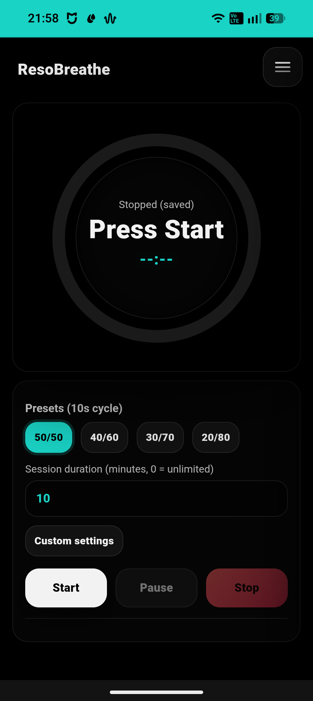

# ResoBreath

ResoBreath is a lightweight, fully customizable **resonance breathing** timer built as a **local-first**, privacy-friendly web app. It is designed to help users practice slow paced breathing (typically 4 to 6 breaths per minute) and track sessions over time.

## Safety disclaimer

This app is for general breathing practice and tracking. It is not medical advice. Stop if you feel unwell (for example dizziness, chest pain, unusual shortness of breath). If you have a medical condition, talk to a clinician before starting any new breathing practice.

---

## App Preview



---

## Quick start

Just open the web app:

✅ https://breath-tools.github.io/ResoBreath/

No account, no setup.

---

## Install (PWA)

ResoBreath is a **Progressive Web App**, meaning it can be installed on your device for offline use and a native feel.

### Android (Chrome)

1. Open the web app.
2. Tap **⋮** -> **Install app** (or **Add to Home screen**).

### iOS (Safari)

1. Open the web app.
2. Tap **Share** -> **Add to Home Screen**.

### Desktop (Chrome / Edge)

1. Open the web app.
2. Click the **Install** icon in the address bar.

---

## Features

* **Resonance breathing**: Slow breathing (commonly 4 to 6 breaths/min) often used to support HRV training.
* **Visual Feedback**: Real-time progress ring with phase cues (Inhale/Exhale).
* **Customizable**: Adjust inhale/exhale durations to find your preferred rhythm.
* **Session tracking**: 14-day chart plus detailed session history.
* **Local-first**: Data is stored on your device using PouchDB.
* **CouchDB Sync**: Optional multi-device synchronization.

---

## Privacy & Offline Support

* **Privacy**: Your data stays on your device. Sync is optional and requires your own CouchDB instance.
* **Offline**: Designed to run without a network connection once loaded using a Service Worker.

---

## CouchDB Sync (Optional)

Enable sync from **Settings** using:

* CouchDB Server URL
* Database name
* Basic Auth credentials

### ⚠️ Security Warning

If you enable **Remember password**, the app stores your CouchDB password locally in a cookie for 14 days (renewed when you connect). This cookie is readable by JavaScript (this is a static app, so it cannot set an HttpOnly cookie). Use this feature only on private, trusted devices.

Notes:

* This is convenience storage, not strong protection. It does not protect against XSS, malicious browser extensions, shared OS accounts, or anyone with local browser access.
* To remove stored credentials, disable **Remember password** and clear this site’s cookies/site data in your browser settings.

---

### Auto-connect behavior

* If **Remember password** is enabled and you are online, the app will try to auto-connect to CouchDB on launch and when the device comes back online.
* If you are offline, it runs fully offline and sync resumes automatically when online.

---

## CouchDB Server Setup

To enable multi-device sync, you need your own CouchDB instance with the following configuration:

### Requirements

1. **Enable CORS** in `local.ini`:

   ```ini
   [chttpd]
   enable_cors = true

   [cors]
   origins = https://breath-tools.github.io
   credentials = true
   ```

   **Note:** Do not use `origins = *` with `credentials = true`. For local testing, set `origins` to your dev origin (for example `http://localhost:8000`).

2. **Create a user** (via admin panel or curl)

3. **Create database** named `ResoBreath` (or your choice)

4. **Set permissions**: Add your user to database members

5. **Use HTTPS** (required for production) - use reverse proxy like Nginx/Caddy

### Common Issues

* **CORS errors**: Enable CORS in config, restart CouchDB
* **401/403**: Check user exists and has database access
* **Mixed content**: Must use HTTPS if app is on HTTPS

---

## Project status

This is a **vibe-coded** hobby project. It may be minimally maintained and inactive for periods of time. Use at your own risk. PRs are welcome.

---

## License

This project is licensed under the **GNU GPL v3**.

## Third Party Notices

This project bundles the following third-party software:

### PouchDB

* Component: `pouchdb.min.js`
* Project: PouchDB
* License: Apache License 2.0
